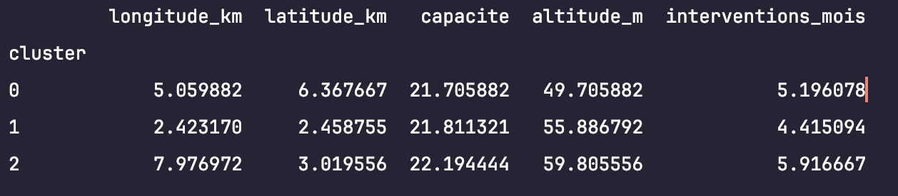
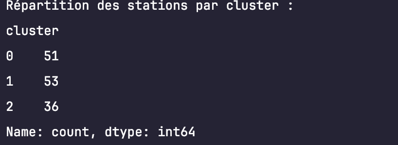

# 🚴‍♂️ Projet Citycycle — Optimisation Data Mining du Réseau

## 1. Contexte Métier & Ultimatum (Business Understanding)

Citycycle exploite 1 800 vélos sur 140 stations pour le compte d'une collectivité. Deux stations sur trois sont vides aux heures de pointe pendant que d'autres débordent, et le rééquilibrage se fait au jugé depuis trois ans. La collectivité a prévenu : si le taux de disponibilité ne remonte pas, la délégation ne sera pas renouvelée.

### 📍 Synthèse de la Problématique

---

### 🎯 Objectif du Projet & Démarche CRISP-DM
Face à cet ultimatum, l'objectif de ce projet Data Mining est de sortir d'une gestion empirique (« au pif ») pour mettre en place une stratégie opérationnelle pilotée par la donnée et basée sur 4 algorithmes clés :
* **Clustering (K-Means / DBSCAN) :** Segmenter les 140 stations et cibler les zones prioritaires de tension.
* **Régression Linéaire :** Anticiper les volumes de trajets et mesurer le poids réel des facteurs (météo, heures, emplacements).
* **Classification (k-NN) :** Identifier les profils d'abonnés à risque de résiliation pour sécuriser nos revenus.

Le présent document retrace l'intégralité de notre démarche CRISP-DM question par question : **la problématique métier**, **la méthode retenue et sa justification**, ainsi que **les conclusions et recommandations stratégiques** formulées pour la direction commerciale.

---
## 🛠️ 2. Data Preparation (Préparation des Données)

Le module `src/data_loader.py` prend en charge le nettoyage et l'enrichissement des données sources pour alimenter les modèles d'analyse :

* **Stations (`Citycycle_stations.csv`, 140 lignes) :** Données déjà propres (aucun doublon, aucune valeur manquante). Le module supprime par sécurité les doublons éventuels et impute à 0 les interventions manquantes.
* **Trajets (`Citycycle_trajets.csv`, 760 → 697 lignes) :**
  * Suppression de 60 doublons ;
  * Suppression de 3 trajets de 1440 min (24 h, vélos non restitués ; seuil retenu : 180 min) ;
  * Recalcul des 3 distances à −1 à partir des coordonnées des stations (`distance_km` est une distance à vol d'oiseau) et repérage des 2 trajets en boucle de distance nulle (`est_boucle`) ;
  * Imputation de la température manquante par la médiane et du type d'abonnement manquant par `inconnu` ;
  * Création des indicateurs binaires `est_heure_pointe` (créneaux 7h-9h et 17h-19h, soit les heures 7, 8, 17 et 18) et `est_pluie`.
* **Abonnés (`Citycycle_abonnes.csv`, 500 lignes) :** Création de la variable cible `target_churn` pour la classification (1 = n'a pas renouvelé, 0 = a renouvelé).

Les données nettoyées sont exportées dans `data/processed/` en exécutant `python src/data_loader.py`. Chaque anomalie et la décision prise sont détaillées dans [`docs/journal_donnees.md`](docs/journal_donnees.md).

---

## 📊 3. Question 1 : Segmentation des Stations (Clustering K-Means)

### ❓ Problématique Métier
> *Comment regrouper les 140 stations qui rencontrent les mêmes problèmes (manque de vélos, saturation, pannes) afin d'organiser le rééquilibrage par type de quartier ?*

### ⚙️ Méthode Retenue (`src/clustering.py`)
* **Algorithme :** **K-Means ($K=3$)** — Choisi car nous n'avons pas d'étiquettes de quartiers dans le fichier CSV ; l'algorithme regroupe les stations automatiquement selon leurs points communs.
* **Prétraitement :** Suppression de `station_id` et mise à l'échelle des données (`StandardScaler`) pour que l'altitude et le nombre d'interventions aient le même poids.
* **Validation :** Score de Silhouette de **`0.2708`** (séparation cohérente des 3 groupes).

---

### 📈 Résultats Visuels & Analyse

#### Figure 1 : Exploitation (`Capacité` vs `Interventions/mois`)

* **Résultat :** À capacité égale (~22 bornes), le **Cluster 2** demande beaucoup plus d'interventions (**~5,9/mois**) que le **Cluster 1** (**~4,4/mois**).

* **Raisonnement :** Ce n'est pas la taille de la station qui crée les problèmes, mais l'usage et le relief.

#### Figure 2 : Carte Géographique (`Longitude` vs `Latitude`)

* **Résultat :** Les 3 couleurs forment 3 zones géographiques bien séparées sur la carte de la ville.
* **Raisonnement :** L'algorithme a retrouvé tout seul la géographie de la ville (hypercentre, quartiers résidentiels plats et quartiers en hauteur).
---

### 💼 Réponse Commerciale & Décisions

L'analyse identifie **3 types de quartiers** :

1. **Cluster 0 — Quartiers d'Affaires / Hypercentre (51 stations) :** Forte offre et forte demande. Risque de **saturation des bornes** le matin quand tout le monde arrive au travail.
2. **Cluster 1 — Quartiers Résidentiels (53 stations) :** **Stations vides tôt le matin** lors des départs vers le travail.
3. **Cluster 2 — Zones en Hauteur / Reliefs (36 stations) :** Altitude élevée (~60 m). Les usagers descendent à vélo en centre-ville mais ne remontent presque jamais les côtes, ce qui vide les stations et use davantage les vélos.

#### 🎯 Plan d'Action
* **Tournées des camions (6h - 9h) :** Remonter en priorité les vélos vers le **Cluster 2 (hauteurs)** le matin pour garantir la disponibilité aux usagers, et **vider les bornes du Cluster 0 (hypercentre)** avant 9h pour éviter la saturation.
* **Bonus Remontée :** Offrir des minutes gratuites aux abonnés qui ramènent un vélo du centre-ville vers les hauteurs (Cluster 2).
* **Maintenance ciblée :** Renforcer l'entretien technique sur les stations du Cluster 2.

### Q5 : quand et à quels signes repérer le non-renouvellement ?

**Ce que j'ai compris.** Sur les 360 abonnés annuels, 22 % (78) n'ont pas renouvelé.
Il faut dire à partir de quand le risque change et quels comportements l'annoncent.

**Résultat.** Le risque est élevé et stable (23 à 27 %) pendant environ les 30
premiers mois, puis tombe autour de 10 à 15 % au-delà de 30-35 mois. Trois signaux
sont indépendants entre eux : peu de trajets (29 % de départs à 4 trajets/mois ou
moins, contre 9 % au-delà de 14), 2 incidents ou plus (environ 50 %) et une
ancienneté courte. La distance moyenne ne montre aucune tendance.

**Méthode.** Régression logistique : ses coefficients se lisent directement
(trajets −0,45, incidents +0,32, ancienneté −0,24 en variables standardisées).
Un arbre de décision fait moins bien en validation croisée (l'AUC 0,55 à 0,58 contre 0,64),
car 360 lignes sont trop peu pour qu'il trouve de bons découpages.

**Vérification.** AUC de 0,64 en validation croisée stratifiée (5 plis x 10
répétitions), écart-type 0,07, contre 0,50 pour le hasard. Le modèle classe les
abonnés par niveau de risque mais ne prédit pas individuellement un départ.

**Recommandation.** Surveiller les abonnés à faible usage ou avec 2 incidents ou
plus, surtout avant ~32 mois d'ancienneté, et les contacter avant l'échéance.

### Q6 : combien solliciter, à partir de quel coût ?

**Ce que j'ai compris.** Contacter les abonnés les plus à risque en premier et
trouver la part à joindre pour retenir la moitié des partants, puis le coût par
contact au-delà duquel l'opération n'est plus rentable.

**Résultat.** Contacter environ un tiers des abonnés annuels (117 sur 360)
suffit à capter la moitié des partants (39 sur 78), contre la moitié des abonnés
au hasard.

**Méthode.** Courbe de gain sur le risque calculé en validation croisée (Q5).
Seuil de rentabilité = prix x taux de succès x partants captés / abonnés contactés.

**Hypothèses (le sujet ne fournit ni prix ni taux de succès).** Abonnement à
100 € et taux de succès de 100 %, soit un coût maximal de 33 € par contact. Le
seuil est proportionnel au prix (50 € → 17 €, 150 € → 50 €, 200 € → 67 €) et
au taux de succès : à 30 % de réussite, il tombe à environ 10 €.

**Limites.** 78 partants seulement, donc un ordre de grandeur ; le modèle est
modeste (AUC 0,64) ; le taux de succès d'une relance n'est pas observé dans les
données.

**Recommandation.** Cibler en priorité le tiers d'abonnés les plus à risque, et
seulement si l'action de rétention coûte moins du tiers du prix de l'abonnement.